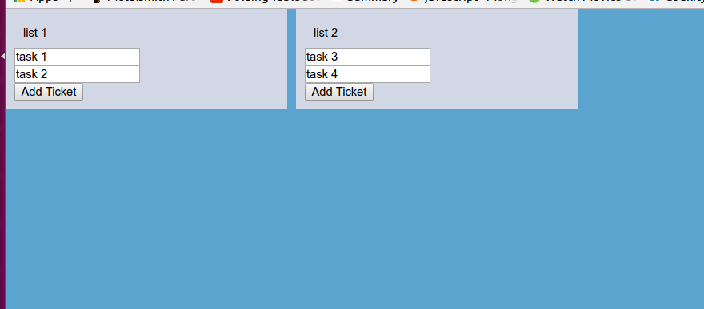

Write Jrello - A Trello Clone
================================

This tutorial shows how to write a Trello like ticketing system startup from scratch.   
At every step, we will consider the minimal viable product requirements and implement them.   

As inspiration, lets use Trello since it is very powerful yet simple.   
For the purpose of this article we will simplify it further.       


The stack I will use is the MEAN stack - Mongo, Express, Angular and Nodejs.    
The MEAN stack has no particular advantage over other technologies.         
So picking this technology is simply my personal taste.  
Here are some reasons that make me like these technologies: 

 - Nodejs
    - It has a great dependency mechanism. It is relative rather than global - both in file system and path. 
      This means:  
        - You can have multiple versions of the same code in one project - which makes dependencies much more stable. 
        - You can easily pack your code 'to go'. 
        - It is very easy to publish your code to use - micro library.     
          This in turn means there's a lot of code out there you can use for Nodejs.   
          It also means you can easily separate your code to small libraries.   
        - Combines with nvm (Node Version Manager) you can easily have multiple node version on your computer. 
    - It has a great stack of utilities for the development environment.
       - nodemon and lite-server auto refresh your process once code changes which accelerates your development process - remember there's no compilation!
       - bower organizes your frontend dependencies (and I still like it even though npm can replace it :) )
       - npm scripts is a very powerful way to add functionality to your development environment
       
       I find it very useful to have Nodejs in any project - never mind the language.
    - It is light. I like the fact I can run Nodejs on a micro machine in Amazon.    
    - It is asynchronous by nature. This makes it a very suitable technology for the web as web servers.
    - Combines with [Electron](http://electron.atom.io/) we can easily publish a native client to our app.
     
 - Express is a very straight forward library that helps organize your server's code.
 - Mongo plays very well with Nodejs and its schemaless nature makes development very easy - especially when you start a project. 
 - Angular 
    - It is a complete framework for the frontend. No need to integrate multiple libraries.
    - I think it barely has any learning curve - I never understood those who said otherwise. 
    - It separates HTML from JavaScript, which I like.
 - They are all JavaScript. 
     - JavaScript is awesome 
       - It is a scripting language and so you see results right after writing the code.  
       - Its runs on engines written by the biggest companies and used by everyone using a browser.
     - One language for all environments. 
    
    
To get things started, I use [a scaffold project](https://github.com/coder-on-deck/nodejs-easy-setup) that includes a basic angular setup and a backend.
 

Step 1 - Managing tickets on a board
============================

For the first step I chose to assume
 
  - a single board with lists and tickets 
  - no users, no collaboration    

## Create the 'board' page

First lets setup a board view that allows users to add lists and tickets.
   
For that we will define a page in angular   

```
// file : app.js

angular.module('demo', ['ngRoute']).config(function ($routeProvider) {
  console.log('configuring')

  $routeProvider
    .when('/board', {
      controller: 'BoardPageCtrl',
      templateUrl: '/app/views/board_page.html'
    });
})
```

Then we will define the controller with some mock data we can display

```
// file : BoardPageCtrl.js 

angular.module('demo').controller('BoardPageCtrl', function ($scope) {
  $scope.lists = [
    {
      name: 'list 1',
      tickets: [
        {title: 'task 1'},
        {title: 'task 2'}
      ]
    },
    {
      name: 'list 2',
      tickets: [
        {title: 'task 3'},
        {title: 'task 4'}
      ]
    }
  ]
})
```

As you can see, I chose a very naive data model with the following traits:    

 - I have an array of lists.   
 - Each list has a name and its tickets.   
 - Each ticket has a title.    

While this model might change in the future, it is too early for me to consider anything more complex.   
When I think about the first functionality I would like to add - which is CRUD (Create, Read, Update, Delete) for lists and tickets,   
I am convinced this model is sufficient. So I move on.   

Now lets add the view to display the lists and tickets.   
For starters, I'd like to see I wired everything correctly. So I will start with a simple page

```html
<!-- file : /app/views/board_page.html -->

This is the board page
```

To verify everything is fine, I simply run `npm start`.   
Thanks to the awesome simple nodejs setup, the browser should open.   
But alas, the text does not appear. So lets troubleshoot it. 

## Common mistakes so far

 - **problem #1 - I did not define a default route**   
   The board route specifies a `/board` page, but my browser is opened on `/index.html` file.   
   I can manually write `/index.html#/board` or simply add a default route.   
   I prefer the latter and so I write 

   ```javascript

   // file : app.js

       ... 
       .otherwise({redirectTo: '/board'})
   ```

 - **problem #2 - I forgot to include a .js file**

   No I can see the blue background color, but still no tickets.   
   When I open the console I see an Error with the message `Argument 'BoardPageCtrl' is not a function, got undefined`   
   
   I verify I spelled the controller correctly on the route. It is correct.    
   
   When I add a log print `console.log('initializing controller')` at the top of the page, I see the code is not invoked.   
   When I modify the angular module name to one that does not exist, an Error is not thrown.. 
   
   This leads me to conclude I forgot to add the javascript file in index.html

**now everything works!** so lets move on..  

## Painting the tickets

Now that we made sure everything is wired correctly, we can move on to painting the tickets.   
I start the html by adding a div with id matching the page's name.   
This is a habit of mine as some of the css will be specific to this page.   

```html
<div id="board-page">
    This is board page
</div>
```

Now I would like to display a list and enable changing its name.

```html
<div ng-repeat="list in lists" class="list">
    <input class="list-name" ng-model="list.name"/>
</div>
```

I chose a simple implementation of showing the name in an input.   
For now it looks bad but provides the functionality we desire.   
We can fix the display issue when we reach the css.  

Next I would like to paint the tickets for each list. 

```html
<div ng-repeat="ticket in list.tickets" class="ticket">
    <input class="ticket-title" ng-model="ticket.title"/>
</div>
```

Last but not least, I want to add a button with the label `Add Ticket`.  

```html
<button class="add-ticket"> Add Ticket </button>
```

The final html looks like this

```
<!-- file : /app/views/board_page.html -->

<div id="board-page">
    <div ng-repeat="list in lists" class="list">
        <input class="list-name" ng-model="list.name"/>
        <div class="list-content">
            <div ng-repeat="ticket in list.tickets" class="ticket">
                <input class="ticket-title" ng-model="ticket.title"/>
            </div>
        </div>
        <button class="add-ticket"> Add Ticket </button>
    </div>
</div>
```

We have yet to finish the functionality. The `Add Ticket` button does nothing. But before we move on with the functionality, I would like things to look awesome. 

## Adding color and layout

So far, everything looks awful. So it is time to add some style.   
To keep my project organized, I create a file named `_board_page.scss` (notice the naming convention I keep)   
and I start it with the page's id. 

```sass
#board-page{
}
```

I then start by adding the board's background color 

```sass
$BOARD_BACKGROUND_COLOR: #5BA4CF;
background:$BOARD_BACKGROUND_COLOR;
```

Colors have the tendency to be reused. So I prefer to keep it in a variable. I think it is more readable too.   

Now I want the background to be all over the page.   
I could use `width: 100%` and `height: 100%`, but that has some other implications I'd like to avoid.    
So instead, I prefer to use `absolute positioning`. It will also resolve some scrolling issues for me down the road.
 
```scss
$BOARD_PAGE_PADDING:0px;
position:absolute;
top:$BOARD_PAGE_PADDING;
bottom:$BOARD_PAGE_PADDING;
left:$BOARD_PAGE_PADDING;
right:$BOARD_PAGE_PADDING;
```

Next, lets make the lists horizontal - one besides the other. 

```scss
.list{
    display:inline-block;
}
```

Now, lets add background to the lists with some spacing and display the title properly 

```
  .list{
    display:inline-block;
    $LIST_BACKGROUND_COLOR: #D2D7E5;
    background:$LIST_BACKGROUND_COLOR;
    width:300px;
    padding:10px;
    
    &:not(:first-child){
      margin-left:10px;  
    }
    
    .list-name{
      padding:10px;
      border:none;
      background:transparent;
    }
  }
```

And I also add padding on the `#board-page` with `padding:20px;`
 
Note that I used `margin-left` to have spacing between the lists, but when I wanted spccing from the page, I added padding on the page.   
I could have added `margin-top` on the lists and `margin-left` on the `left-child` to achieve the same thing.   

The reason I chose to implement it this way is that if I ever added anything else on the page, I can rest assured it will be aligned with the lists properly.    
The alternative would force me to add the margins repeatedly to every element I will add in the future. 
 

This is what I can see 



Now lets style the button 

```scss
.add-ticket{
  $ADD_TICKET_BACKGROUND_COLOR:linear-gradient(to bottom,#61BD4F 0,#5AAC44 100%);
  background:$ADD_TICKET_BACKGROUND_COLOR;
  color:white;
  font-weight: bold;
  border:none;
  padding:10px;
}

.list-content {
  margin-bottom:20px;
}
```

Lets add some style to each ticket

```scss
.ticket{
  background:white;
  &:not(:first-child) {
    margin-top: 10px;
  }
  .ticket-title{
    width:100%;
    padding:20px;
  }
}
```

I ignore the first child when I add the margin because I don't like it when distance between 2 elements in the page is a sum of 2 styles.   
In this case 

 - `padding` on the list name
 - `margin-top` on the ticket
 
I also want to avoid the possibility that the distance between the title and the first ticket, and the distance between the tickets are somehow connected.   
I want to be able to change one without the other.. 

You might be wondering why am I being so meticulous with the style.    
The reason is that I find it much harder to detect style regressions than functionality regressions, mainly before the former is hard to test automatically.   
So paying attention to small details and acquiring good practices with css will save you a lot of time down the road. 

This is the final `scss` file

```scss
#board-page{
  $BOARD_BACKGROUND_COLOR: #5BA4CF;
  background:$BOARD_BACKGROUND_COLOR;
  
  $BOARD_PAGE_PADDING:0px;
  position:absolute;
  top:$BOARD_PAGE_PADDING;
  bottom:$BOARD_PAGE_PADDING;
  left:$BOARD_PAGE_PADDING;
  right:$BOARD_PAGE_PADDING;
  
  padding:20px;

  .list{
    display:inline-block;
    $LIST_BACKGROUND_COLOR: #D2D7E5;
    background:$LIST_BACKGROUND_COLOR;
    width:300px;
    padding:10px;
  
    .list-content {
      margin-bottom:20px;
    }
    &:not(:first-child){
      margin-left:10px;  
    }
    .list-name{
      padding:10px;
      border:none;
      background:transparent;
    }

    .add-ticket{
      $ADD_TICKET_BACKGROUND_COLOR:linear-gradient(to bottom,#61BD4F 0,#5AAC44 100%);
      background:$ADD_TICKET_BACKGROUND_COLOR;
      color:white;
      font-weight: bold;
      border:none;
      padding:10px;
    }

    .ticket{
      background:white;
      &:not(:first-child) {
        margin-top: 10px;
      }
      .ticket-title{
        width:100%;
        padding:20px;
      }
    }
  }
}
```

So far, all my style is under the `#board-page` and I am not defining reusable components.   
This will be a refactoring I will do once I find myself copy-pasting.. 

I like this approach, it keeps me very goal oriented. I am not thinking about `infrastructure` yet, but once I need it, a small refactoring will get me there. 

If you are not seeing the style changes, make sure you remembered to add an `@import 'board_page';` statement to `main.scss`
 
Step 2 - Adding list and ticket functionality
=============================================

It is time to enable adding tickets and lists..  
I already have a hook for adding a ticket on the `Add Ticket` button. 
I also need some action to add a list.   
For now binding it to `double-click` on the board sounds nice.    

```html
<!-- board_page.html -->
<div id="board-page" ng-dblclick="addList()">
```

And in the controller we will implement those functions 

```javascript

// BoardPageCtrl.js

$scope.addList = function () {
  $scope.lists.push({name: 'new list', tickets: []})
}

$scope.addTicket = function (list) {
  list.tickets.push({})
}

```

pretty simple, and it will do for now. 

Step 3- Testing time
=======================

So I play along with my new shiny app, and I discover some style issues.   
Lets review them and see how to resolve them

## Lists are not aligned to top


When I create a new list, it is not aligned to the top

This can be easily fixed by telling all the lists to be aligned to top. simply add `vertical-align: top;` on `.list`
 

## Lists exceed the page content

When I click 'Add Ticket' repeatedly I see the lists spills over the content area. 


To quickly fix this I add the following css

```
.list-content {
  max-height: 80%;
  overflow-y: auto;
  $SCROLL_OFFSET:5px;
  padding-right:$SCROLL_OFFSET;
  margin-right:-$SCROLL_OFFSET;
}
```

Pay attention to the ugly `max-height:80%`. It is a very ugly solution.   
The distance between the bottom of the list to the end of the page will change according to screen height.    
Which means if the screen resolution is high, the list will end relatively high on the screen.    
If the screen is small, the bug will still reproduce.    
So why did I implement it this way? 

Simply because the correct solution for this problem is cumbersome amd requires very good css skills to get it right. 

## Generating many lists will overflow to the next line

When I try to add a lot of lists, I see this horrifying image


This is easily solved by adding `white-space: nowrap` on the board. 

```css
#board-page{
  overflow-x:auto;
  white-space: nowrap;
}
```

Step 4 - Adding some coolness - Drag & Drop
==================================================

So far, we have some pretty fair results.    
But Trello is very famous for its drag & drop ease and it would be a shame not to have it.. 

Luckily, there's a pretty nifty angular library called [angular-drag-and-drop-lists](https://github.com/marceljuenemann/angular-drag-and-drop-lists)    
So I quickly add it by running `bower install -S angular-drag-and-drop-lists`.    
I also add the relevant javascript file to `index.html` and I add a module dependency

```javascript

// app.js 

angular.module('demo', ['ngRoute', 'dndLists'])...
```

Following its instructions I add some `dnd` attributes on my ticket `div`.  

```html
<!-- board_page.html -->

<div ng-repeat="ticket in list.tickets" class="ticket" 
     dnd-draggable="ticket"
     dnd-dragstart="list.tickets.splice($index, 1)"
     dnd-effect-allowed="move">
    <input class="ticket-title" ng-model="ticket.title"/>
</div>
```

And then I eagerly go to verify it works, and it works!    
But it's ugly.. So I add the following style 

```scss
li.dndPlaceholder{
  $PLACEHOLDER_COLOR:rgba(0,0,0,0.5);
  height:60px;
  list-style:none;
  background: $PLACEHOLDER_COLOR;
  margin-top:10px;
}

```

This is much better, but still, something is not smooth enough when I try to move a ticket to the bottom.    
The reason is that there is not enough space between the list body and the button, so I use a quick solution by adding

```scss
.list-content{
  padding-bottom:60px;
}
```

When I play with it a bit more, I find it is still not smooth when I have a lot of tickets and the content is scrolled.   
For now, I will let it be and the functionality works, but there is some mild discomfort.    
I will open an issue on `angular-drag-and-drop-lists` project and on mine and add a reference between them.   

## Lets look at how drag-and-drop is implemented  

I would like to pause for a minute and investigate how this library works.    
It contains [only 1 file](https://github.com/marceljuenemann/angular-drag-and-drop-lists/blob/master/angular-drag-and-drop-lists.js) of 500 lines - most of them are documentation.    
So it shouldn't take long to understand how it works.   

There are several cool things in this library I note: 

 - The directive does not have an isolated scope
   This calms me down as I know I cannot have 2 directives with isolated scopes on the same element. So no problem here
 - `event.dataTransfer.setData("Text", angular.toJson(scope.$eval(attr.dndDraggable)));`
   This line shows how this library translate the string representing the draggable model to the actual model.    
   It evaluates the model from the scope using `scope.$eval`. In our case `attr.dndDraggable` is `ticket`. 
 - `$parse(attr.dndDragstart)(scope, {event: event});`
   Invokes the `start` callback. 
   
These are a couple of nice things to know you can do with angular.   
And if I combine this knowledge with [drag and drop MDN documentation](https://developer.mozilla.org/en-US/docs/Web/API/HTML_Drag_and_Drop_API) I can wrap my head around the entire implementation.   

Lets look at our final results
================================

All the code above gets us to some initial results


As you can see, I was not joking when I said that Trello will be my inspiration.   

To recap all we've done so far

 - We wrote the first page for our Trello like application 
 - We added style to the page
 - We added the ability to add lists and tickets. 
 - We added Drag and Drop ability. 

The following steps will include adding persistancy and stepping toward collaboration.   
I invite you to a live session on October 10th to see those next steps implemented live!


<link rel="stylesheet" href="writing-your-own-ticketing-system/custom.css">