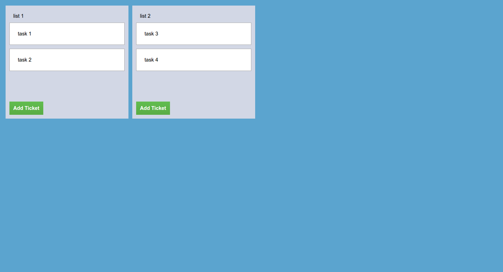

Write Your Own Ticketing System
================================

In this tutorial we will start a ticketing system startup from scratch.   
At every step, we will consider the minimal viable product requirements and implement them.   

As inspiration, lets use trello since it is very powerful yet simple enough for this tutorial.   
Trello's model contains multiple boards per user. Each board contains multiple list and each list contains multiple tickets.    


The stack I will use is the MEAN stack, and to get things started, I use [a scaffold project](https://github.com/coder-on-deck/nodejs-easy-setup) that includes a basic angular setup and a backend.
 

Step 1 - Managing tickets on a board
============================

For the first step I chose to assume a single board and implement a list and tickets management on that board.    
I am also ignoring users and collaboration features for now.

## Frontend

First lets setup a board view that allows users to add lists and tickets.
   
For that we will define a page in angular   

```js
angular.module('demo', ['ngRoute']).config(function ($routeProvider) {
  console.log('configuring')

  $routeProvider
    .when('/board', {
      controller: 'BoardPageCtrl',
      templateUrl: '/app/views/board_page.html'
    })
    .otherwise({redirectTo: '/board'})
})

```

Then we will define the controller to have

 - Some mock data to use
 - Adding a list ability
 - Adding a ticket ability

```
angular.module('demo').controller('BoardPageCtrl', function ($scope) {
  $scope.lists = [
    {
      name: 'list 1',
      tickets: [
        {title: 'task 1'},
        {title: 'task 2'}
      ]
    },
    {
      name: 'list 2',
      tickets: [
        {title: 'task 3'},
        {title: 'task 4'}
      ]
    }
  ]
})
```

Now lets add the view to display the lists and tickets.   
This HTML will simply iterate over the lists and their tickets.   
For now, lets bind `add list` to  double clicking the board.   

```
<div id="board-page">
    <div ng-repeat="list in lists" class="list">
        <input class="list-name" ng-model="list.name"/>
        <div class="list-content">
            <div ng-repeat="ticket in list.tickets" class="ticket">
                <input class="ticket-title" ng-model="ticket.title"/>
            </div>
        </div>
        <button class="add-ticket"> Add Ticket </button>
    </div>
</div>
```

And last but not least lets add some style using sass

```scss
#board-page{
  $BOARD_BACKGROUND_COLOR: #5BA4CF;
  $BOARD_PAGE_PADDING:0px;
  $BOARD_CONTENT_PADDING:20px;
  
  $LIST_BACKGROUND_COLOR: #D2D7E5;

  $ADD_TICKET_BACKGROUND_COLOR:linear-gradient(to bottom,#61BD4F 0,#5AAC44 100%);
  
  
  background:$BOARD_BACKGROUND_COLOR;
  padding:$BOARD_CONTENT_PADDING;
  position:absolute;
  overflow-x:auto;
  white-space: nowrap;
  max-height:100%;

  top:$BOARD_PAGE_PADDING;
  bottom:$BOARD_PAGE_PADDING;
  left:$BOARD_PAGE_PADDING;
  right:$BOARD_PAGE_PADDING;
  
  
  .list{
    vertical-align: top;
    background:$LIST_BACKGROUND_COLOR;
    width:300px;
    display:inline-block;
    padding:10px;
    .list-content {
      max-height: 80%;
      overflow-y: auto;
      $SCROLL_OFFSET:5px;
      padding-right:$SCROLL_OFFSET;
      margin-right:-$SCROLL_OFFSET;
      padding-bottom:60px;
      margin-bottom:20px;
    }
    &:not(:first-child){
      margin-left:10px;  
    }
    .list-name{
      padding:10px;
      border:none;
      background:transparent;
    }
    
    .add-ticket{
      background:$ADD_TICKET_BACKGROUND_COLOR;
      color:white;
      font-weight: bold;
      border:none;
      padding:10px;
      
    }
    
    .ticket{
      background:white;
      &:not(:first-child) {
        margin-top: 10px;
      }
      .ticket-title{
        width:100%;
        padding:20px;
      }
    }
  }
}
```

All the code above gets us to some initial results



As you can see, I was not joking when I said that trello will be our inspiration.   
Now lets add some persistency.  

## Adding Persistency

To make things super simple, we will 

 - Ignore errors for now    
 - Assume we can save every time the scope changes
 - Ignore collaboration
 
So lets start with the backend 

```
TBD
```


